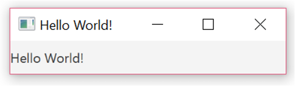
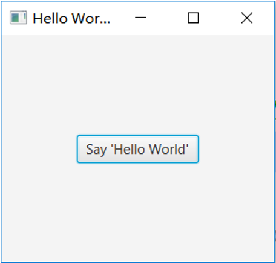
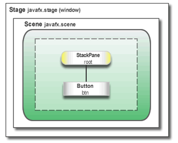
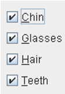
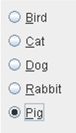
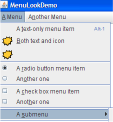
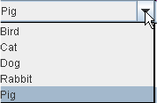

> [!TIP]  
> 🔔 温馨提示：本周练习代码在 `src/main/java/org/anka/week10_javafx` 中  
> 🔗 [点我跳转](src/main/java/org/anka/week10_javafx)
  
# Graphical User Interface: <br>Introduction to Java GUI Construction with JavaFX
  
## Event Based Programming
  
- We introduce some events any time we use Graphical User Interface (GUI)
- We tell the program which events we are interested in and what code we wish to invoke when a particular event occurs.
- We can create a window-based program where the user enters the data and the actions are taken place when some events occur
- There are several libraries in Java to create GUIs among them:
    - Swing and AWT (Abstract Window Toolkit) (used to develop the GUIs in weeks 8 and 9)
    - JavaFX

## Application 1: GUI Hello World
  
  
Old version  
  
  
New version  
  
> We will present the code for this application and then explain how it works!  
  
### Code for Hello World
  
```java
package helloworldgui;

import javafx.application.Application;
import javafx.scene.Scene;
import javafx.scene.control.Label; 
import javafx.stage.Stage;
// JavaFX applications must extend the Application class
public class HelloWorldGUI extends Application {
    @Override
    public void start(Stage primaryStage) {
        // Sets the title of the Stage (Window)
        primaryStage.setTitle("Hello World!");
        // Create a Label to display some text.
        Label label = new Label("Hello World!");
        // Create a Scene to hold the content
        Scene scene = new Scene(label);
        // Add the Scene to the Stage
        primaryStage.setScene(scene);
        // Show the Stage!
        primaryStage.show();
    }
}
```
  
## JavaFX
  
- `Stage`, `Scene` and `Label` are all contained within sub packages of the javafx package.
- JavaFX is included in apache NetBeans 11 and IntelliJ.
- JavaFX is one of the standards for GUI development in Java, replacing Swing.
- Swing first appeared in Java version 1.2. It was implemented on top of the *Abstract Window Toolkit* (AWT) which provided the graphics facilities for earlier versions of Java.
  
## Overview of the JavaFX GUI Structure
  

  
- The `Stage` is the window, this never changes.
- The `Stage` (window) contains a Scene, which can change.
- The `Scene` contains a root `Node`, usually a layout pane (e.g. `StackPane`, `HBox`).
- A `Node` can contain other Nodes (e.g. a `Button`), with some limitations discussed later.
  
## Stage
  
- JavaFX uses a theatre metaphor for describing aspects of the graphical user interface (GUI).
- The `Stage` is the window. The `Stage` never changes, just like if you went to watch a play at the theatre.
- With a JavaFX application, the `Stage` does not need to be created, it is a parameter of the `start` method, which is called when the JavaFX application is run.
  
## Scene
  
- The `Scene` contains the content. The `Scene` is added to the `Stage`, and can change (much like when you watch a theatre production!).
- To construct a `Scene`, a root `Node` must be provided.
- In the Hello World application only a `Label` control `Node` is used, so this is the root `Node`.
- In the Hello World application the Scene object `scene` is added to the Stage object `primaryStage`:
```java
primaryStage.setScene(scene);
```
  
## Nodes

- Node is a general term for content objects in the Scene.
- Node objects can be isolated or contain other ‘child’ Node objects[^1].
- Node objects come in a variety of forms, including control Nodes (e.g. a Button or Label) and layout panes.

[^1]: This does not strictly apply to all Node objects, but those (the majority) who extend the `javafx.scene.Parent` class.  
    Some exceptions include the Canvas, Shape, ImageView and MediaView classes.  

## A Closer Look at Label
  
- A `Label` is a simple control that can display either a short text string or an image.
- A `Label` can respond to mouse events such as a mouse click, mouse entry and mouse exit.

  
## Top Level Containers
  
- A `Stage` is an example of a *Top Level Container*. That is to say that it contains other components, but it is not itself contained by anything.
- Other examples of top level containers are the classes `PopUp` and `FileChooser` (we won’t meet them in this lecture).
  
## Some more JavaFX Control Nodes
  
 TextField  
 Button  
 Checkbox  
 RadioButton  
 Menu  
 ChoiceBox  
  
## Application 2: Get area
  
- We are going to create a simple app that receives the width and length of a rectangle and calculates its area
- We have to tackle two new problems:
    - We have to add `textfields` to our `Scene`, and make sure that they are properly laid out.
    - We have to make sure that something happens when the button is pressed (specifically that the area is calculated when it was pressed).
  
### Layout Management

- In order to add multiple elements we must use a suitable layout pane Node as the root `Node` instead of the `Label` in the Hello World example.
- There are a number of layout panes available in the JavaFX API. For this example, we will use `VBox` (`javafx.scene.layout.VBox`) since it allows child Nodes to be displayed as a vertical column.
  
```java
Button button = new Button("Get Area");
Label label =new Label("Area");

// Here’s where we add the layout pane to the Scene.
VBox root = new VBox();
Scene scene = new Scene(root);
root.getChildren().add(button);
root.getChildren().add(label);
// Here’s where we will add the Button, TextFields and Label control Nodes as children of the layout pane Node.
```
  
#### `VBox` Layout Pane
  
- A layout pane determines where components are to be placed when they are added to a container.
- The `VBox` class makes sure that components are laid out in a vertical column.
- `VBox` has two constructors, one which is parameterless and another which requires a `double` to determine spacing between child Nodes.

```java
new VBox(); // Parameterless constructor
new VBox(5); // VBox with a spacing of 5 between the child nodes
```
  
#### Some Other Layout Managers
  
- `BorderPane`
- `FlowPane`
- `GridPane`
- `StackPane` 
- `TilePane`
- `HBox` (the same as `VBox` but horizontal)
- And more…
We will briefly explain the first three. You can look up the rest for yourself!
  
#### BorderPane
  
`BorderPane` allows five components to be added to Top, Right, Bottom, Left, and Center.  
You specify where the component goes using a second argument to the add method.  
`node1 and node2 are some unspecified Node objects.`
```java
BorderPane borderPane = new BorderPane();
Scene scene = new Scene(borderPane);
borderPane.setCenter(node1);
borderPane.setRight(node2);
primaryStage.setScene(scene);
primaryStage.show();
```
  
#### FlowPane
  
`FlowPane` lays out components from left to right or top to bottom like a `HBox` or `VBox`.  
However when it comes to the right/bottom margin of the FlowPane’s preferred wrap length, set using the `setPrefWrapLength`(`double value`) method on the `FlowPane` object, the child nodes will appear in a new row/column.  
  
#### GridPane
  
`GridPane` lays out components in a grid/table format (columns and rows).  
Basic use of `GridPane` involves adding Nodes and specifying the Node’s column and row indices.  
  
```java
GridPane grid = new GridPane();
grid.add(new Button("A1"), 0, 0); // Col 0, Row 0
grid.add(new Button("A2"), 0, 1); // Col 1, Row 0
grid.add(new Button("B1"), 1, 0); // Col 0, Row 1
grid.add(new Button("B2"), 1, 1); // Col 1, Row 1
```
  
GridPane is one of the more tricky layout panes to use, utilizing ColumnConstraints and RowConstraints to specify widths and heights respectively.  
  
You can find more information here: https://docs.oracle.com/javafx/2/api/javafx/scene/layout/GridPane.html  
  
### Events
  
- We now know how to lay out our UI, but we haven’t yet managed to make it do anything when the button is pressed.
- When a user interacts with a UI events are generated and these can be processed by ***event handlers***.
- A `Button` generates an `ActionEvent` and this event can be processed by a class implementing the `EventHandler` interface.
  
#### Anonymous classes to implement EventHandlers
  
- Anonymous classes are used to handle events. In this case the click on the getArea button.
- Anonymous classes will be seen next year, now you only need to know that they are used in instances where we only need them once for a specific purpose, e.g. to handle specific action events.
  
#### Anonymous Classes
  
```java
btn.setOnAction(new EventHandler<ActionEvent>() { 
    @Override
    public void handle(ActionEvent event) {
        String area = getArea(widthField.getText(), heightField.getText());
        areaLabel.setText(String.valueOf(area));
    }
});
```
- We can use an anonymous class directly in the method call as an actual parameter, rather than specifying a separate class which implements `EventHandler`.
  
### Application 2: Code
  
```java
public class AreaApp extends Application {
    @Override
    public void start(Stage primaryStage) {
        TextField widthField = new TextField("Enter width");
        TextField heightField = new TextField("Enter height");
        Label areaLabel = new Label("Area");
        Button button = new Button("Calculate Area");        
        button.setOnAction(new EventHandler<ActionEvent>() {
            @Override
            public void handle(ActionEvent event) {
                String area = getArea(widthField.getText(), heightField.getText());
                areaLabel.setText(area);
            }
        });
        VBox root = new VBox();
        root.getChildren().addAll(widthField, heightField, areaLabel, button);
        Scene scene = new Scene(root);
        primaryStage.setScene(scene);
        primaryStage.setTitle("Areas");
        primaryStage.show();
    }    
    public String getArea(String w, String h) {
        int height = Integer.parseInt(h);
        int width = Integer.parseInt(w);      
        return String.valueOf(width * height);   
    }
    public static void main(String[] args) {
        launch(args);
    }
} // end of class AreaApp
```
  
## Application 3: Digital Random shapes
  
Our final application will be a simple program that will draw 50 circles in random points on the canvas when the mouse is clicked.  
`We need a canvas`  
`We need to draw graphics`  

```java
public class DrawCircles extends Application {
    // The canvas is an attribute of the class
    private Canvas canvas = new Canvas(400, 400);
    // The canvas is added to the scene
    public void start(Stage primaryStage) {
        VBox root = new VBox();
        root.getChildren().add(canvas);
        Scene scene = new Scene(root);
        primaryStage.setTitle("Draw Circles");
        primaryStage.setScene(scene);
        primaryStage.show();
    }
    private void drawCircles() {
        final int RADIUS = 20;
        Random rand = new Random();
        GraphicsContext gc = canvas.getGraphicsContext2D();
        gc.clearRect(0, 0, canvas.getWidth(), canvas.getHeight());
        for (int i = 0; i < 50; i++) {
            int x = rand.nextInt(canvas.getWidth());
            int y = rand.nextInt(canvas.getHeight());
            gc.fillOval(x, y, RADIUS, RADIUS);
        }
    }
} // End DrawCircles class
```
  
### Responding to Mouse Clicks
  
In order to respond we need to implement the `EventHandler` interface just like with the `Button` click.  
The `EventHandler` asks to receive events by calling the canvas’ `setOnMouseClicked` method.  
Clicking the mouse on the `Canvas` generates a `MouseEvent` which triggers a call to the `EventHandler’s handle()` method.  
  
`MouseEvent` like `ActionEvent` is a subclass of `Event`  
`getButton` lets our `EventHandler` know which `MouseButton` (`PRIMARY`, `SECONDARY`, `MIDDLE`) triggered the `MouseEvent`  
`getX` and `getY` lets our `EventHandler` know the x and y coordinates of the cursor at the time the `MouseEvent` occurred  
See: https://docs.oracle.com/javafx/2/api/javafx/scene/input/MouseEvent.html for this example we are not going to all these methods  
  
### EventHandler implementation
  
The anonymous class to be used (this can be placed in the start method):

```java
canvas.setOnMouseClicked(new EventHandler<MouseEvent>() {
    @Override
    public void handle(MouseEvent me) {
        drawCircles();
    }
});
```
  
## Imports
  
Some of the classes used share the same names as those from other packages, e.g. Point and Color  
Auto import may (will…) get it wrong. So here’s the imports you will need for this application:  
```java
import javafx.application.Application;
import javafx.event.EventHandler;
import javafx.scene.Scene;
import javafx.scene.layout.VBox;
import javafx.scene.canvas.Canvas;
import javafx.scene.canvas.GraphicsContext;
import javafx.stage.Stage;
import javafx.scene.input.MouseEvent;
import java.util.Random;
```
  
