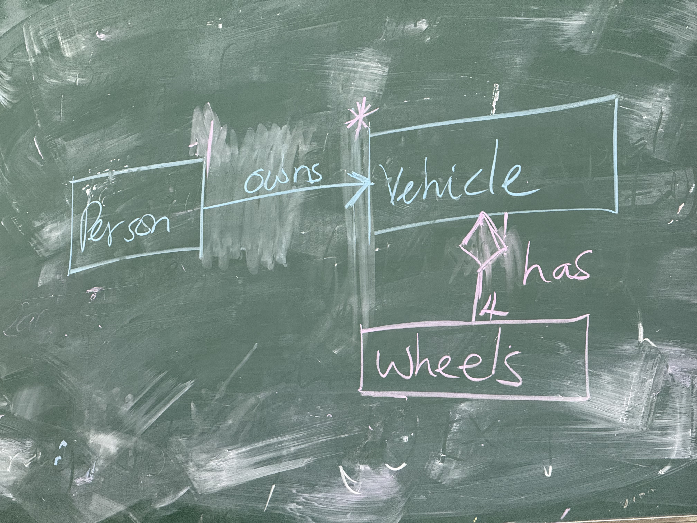
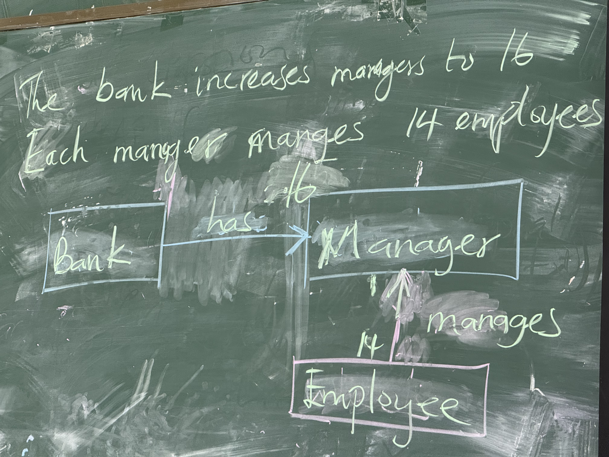
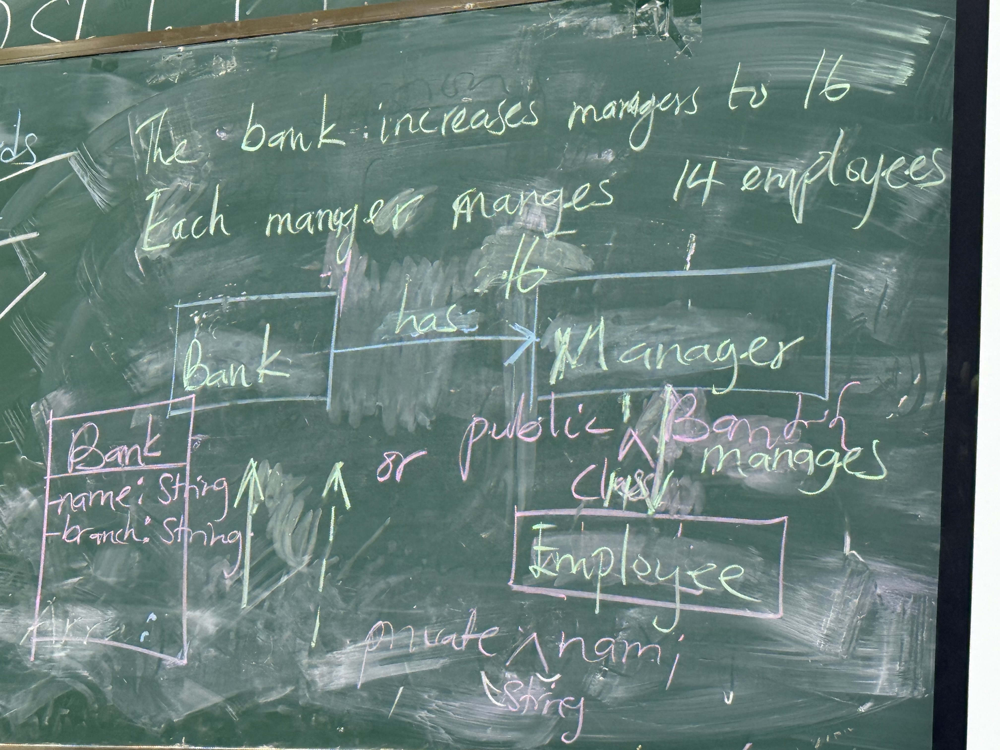

# Revision

1. Keywords
2. Classes and Objects
3. Code Analysis
4. Design（UML）
---
- list
- inheritance
- abstraction
- polymorphism

## Keywords example

1a.  
key: is the value used to access the address in a heap (false)  
example: `HashMap<Key, Value> exampleHashMap;`  
`static`  
`override`  
`int`  
`private`, `final`, `int`, `implement`, `interface`, `abstract`, **`this`**, `override`  

1b.  
(i). 
lists: ordered / non-ordered. 
```java
exampleArrayList.add(Value)
Song.add(songTitle)
exampleHashMap.put(Key, Value)
songTitle.put(1, "Always with Me")
```

(ii)
```java
for (int i = 0; i < 10; i++) {}
for (Datatype each : Song) (enhanced for loop)
```

2a.
```java
public class Country() {
    String name;
    int population;
    LocalDate date;
}

HashMap<String, Country> countinents
public Country(String name, int population, LocalDate date) {
    this.name = name;
    date = System.now;
}
```

## Code analysis——Exception[^1]

```java
try {
    FileInputStream fileIn = new FileInputStream(filePath);
} catch (FileNotFound)

  catch (IllegalArgumentException)

  catch (IO Exception)
```


## OOD

aggregation  
💠菱形表示不确定个数，如大约...个  
→箭头表示确定个数  
  



  

[^1]: 若要深入了解异常处理，请参阅 [Java异常处理](./Java异常处理.md)
