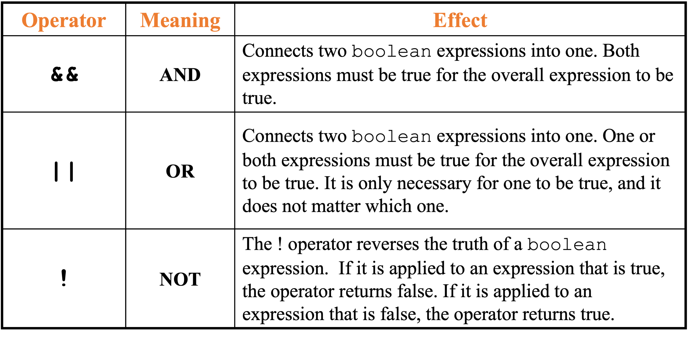

Foundamentals of Java: Decisions, Loops, and Arrays
Java file structure: 
- define package
- (standard Java comment)
- define class
- (standard Java comment)
- define main method
- (one line comment)
- code operation

Primitive Data Types:
- int
- byte
- short
- long
- double
- float
- char
- boolean

Number Types: Floating-point Types
Rounding errors｜舍入误差
BigDecimal接受string和double

Strings
- 两种定义string的方式
- 当创建string对象后，用`==`比较两个相同值的对象仍会返回false
- 此时需要用`.equals()`方法


Reading in user-input:
```Java
import java.util.Scanner;
Scanner kb = new Scanner(System.in);
```


```Java
int width = kb.nextInt(); // nextFloat(), nextDouble(), next() 
int height = kb.nextInt();
```

The if statement:
```Java
if (boolean expression is true) {
  execute the next statement.
}
```

与Python不同，Java使用{}，而不是缩进

```Java
if (coldOutside){
  wearCoat();
  wearHat();
  wearGloves();
}
```

if-else statement:

```Java
if (expression)
  statementOrBlockIfTrue;
else
  statementOrBlockIfFalse;
```

The nested if/else statement:
与Python不同，Java使用nested if，而不是elif

```Java
if (condition1)
     statement1;
else if (condition2)
       statement2;
      . . .
else
     statement4;
```

Comparing strings:
- Don't use `==` for strings!
- Use .equals() method
- Case insensitive test ("Y" or "y")
- if (input.equalsIgnoreCase("Y"))
- String s,t;
- s.compareTo(t) < 0
- means: s comes before t in the dictionary

Compound Boolean Expressions:


Loops:
 - For
```Java
for (initialization; test; update) {
        statement(s);
        }
```
initialization → test → statement(s) → update → test → statement(s) → update ……

- While
```Java
while(condition)
{
statements;
}
```

- do ... while

---
i = 1
i = ++ i + 1 = 2 + 1
j = 1
j = j ++ + 1 = 1 + 
