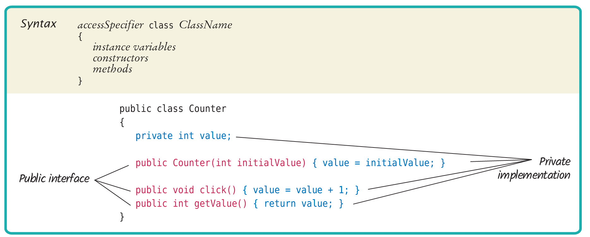
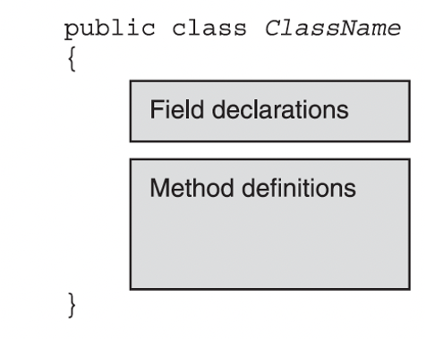

deterministic (for) 确定性的  
non-deterministic  
- for loops  (fixed number of times)
- while loops (not fixed)
- do ... while loops (not fixed)
### Array
```Java
//两种声明Array的方式
int[] numbers = new int[6];
int numbers[] = new int[6];
//elements all 0
int[] numbers = {2, 3, 5, 0, 1, 4};
```
- accessing array  
```Java
for(int i = 0; i < numbers.length; i++){
	System.out.println("numbers["+"i"+"]:"+numbers[i]);
}
```
### Principle of OOP
Objects contain both data and the functionality that operates on that data.  
Controlled by:
- Encapsulation 封装
- Inheritance 继承
- Information hiding 信息隐藏
- Polymorphism 多态性
### Object and Programs

```Java
Scanner scan = new Scanner(System.in);
int width;
System.println("the width of the room");
width=scan.nextInt();
```





1. class
2. ClassName
3. access specifier（访问说明符：用于指定类成员的访问权限的关键字，如public、private和protected）
4. attributes
5. methods
6. one method same with class name (like __init__ in python)

### Classes and Objects naming conventions
Class: upper camel case  
Variable: lower camel case
- getter and setter

```Java
public String getName(){
	return name;
}

public void setTutor(String name){
	tutor = name;
}
```

### The Default Constructor

### Object References

### Array of objects
