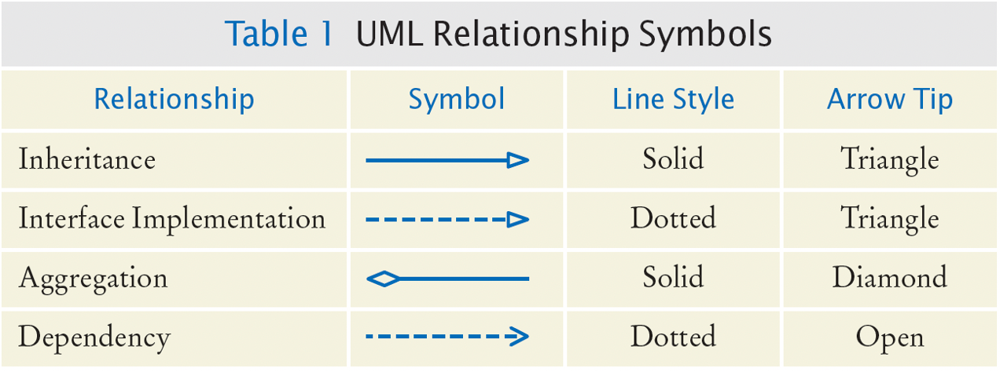
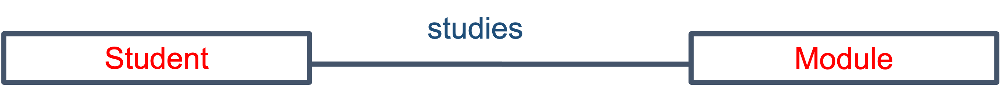
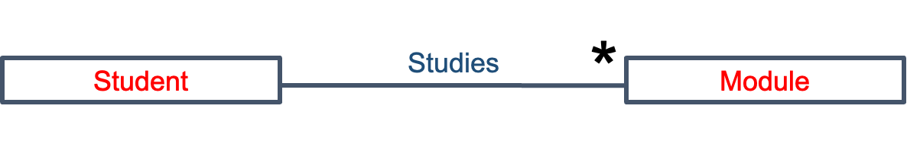
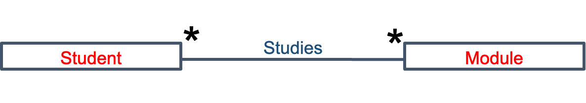
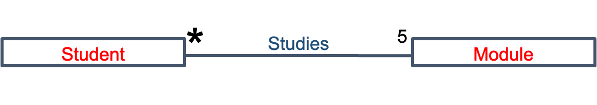
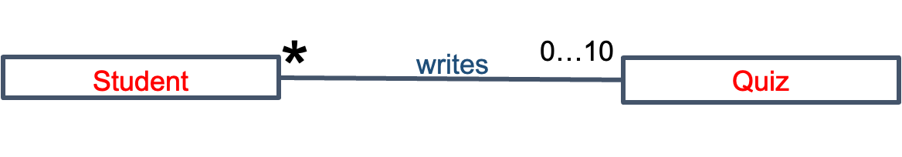
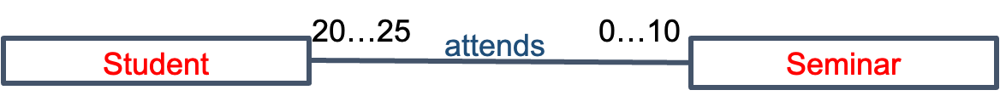

# UML and class composition

Encapsulation    封装  
Constructor    构造器  
Overloading（方法/构造器等）重载  
Data Hiding  
- accessor
- setter
- access specifiers / modifiers

Unified Modeling Language (UML)    统一建模语言  
Use symbols to communicate  
Devised by OMG – Object-Management Group  

## Showing data types

- Can add data types.
- Note order is variable “**:**” **type** (as in Pascal language)
- Empty parentheses, **( )**, indicate a **method** (operation)

<html><body><table><tr><td align="center"><strong>Student</strong></td></tr><tr><td>name: String<br>number: integer<br>course: String</td></tr><tr><td>changeModule(nModule: String): void</td></tr></table></body></html>

## Main Visibility forms in Java

- public, indicated by the keyword `public` –
	- The member can be accessed by code inside the class or outside
	- all classes can see and modify the member

- Private, indicated by the keyword `private` –
	- The member can only be accessed by code inside the class
	- The member can be accessed only by methods that are members of the same class

## Data Hiding

Visibility in Java (Access Modifiers)

|                                   | default | private | protected | public |
| :-------------------------------: | :-----: | :-----: | :-------: | :----: |
| Same Class                        |    ✓    |    ✓    |     ✓     |   ✓    |
| Same Package<br>Subclass          |    ✓    |    ×    |     ✓     |   ✓    |
| Same Package<br>Non-subclass      |    ✓    |    ×    |     ✓     |   ✓    |
| Different Package<br>Subclass     |    ×    |    ×    |     ✓     |   ✓    |
| Different Package<br>Non-subclass |    ×    |    ×    |     ×     |   ✓    |

## Indicating visibility

- **Public** components shown by “**+**”
- Typically (some) methods are made public.
- **Private** components shown by “**-**”
- Typically instance variables are made private and can be reached only through (public) **accessor and mutator** methods (“getters” and “setters”).
- **Protected** components shown by “**#**”
- **Default** components shown by “**~**”

<html><body><table><tr><td align="center"><strong>Student</strong></td></tr><tr><td>- name: String<br># number: integer<br>~ course: String</td></tr><tr><td>+ changeModule(nModule: String): void<br>+ getName():String  // accessor, “getter”<br>+ setName(name: String): void // mutator, “setter”</td></tr></table></body></html>

## Associations
### Showing associations

- A **class-association** diagram* shows the relationship (association) between objects of the classes.
- A class is **associated** with another if you can navigate from objects of one class to objects of the other class
- The lines indicate the existence of some sort of a relationship between an object of the class **Student** and an object of the class **Module**.


Bank has Customers
Zoo has Animals

### Showing associations



### Naming associations

- We name an association (relationship) by writing a word, typically a verb*, above the line.
- It normally indicates the association when read from left to right.
- In this example, the association is that an object of class Student studies an object of the class Module.


### Direction of associations

- If we need the association to be read in a different direction `(reverse order)` then we add a little **triangle** to show the intended direction of reading:


## Multiplicities

- We can also show the multiplicities of an association.
- For example, if a student can study ***any number*** of modules then we can indicate this multiplicity by an asterisk ( * ) at the Module end of the association line:

### Multiplicities – other way too

- We can also show the multiplicities of an association in the other direction.
- For example, if a module can be studied by any number of students then we can indicate this multiplicity by an asterisk ( * ) at the ***Student*** end of the association line:

### Multiplicities – number ranges

- We can also show the actual numbers of a multiplicity of an association.
	- For example, if a student ***must study exactly 5 modules***, we would write 5 for the multiplicity at the Module end.

- We can show ranges of numbers, m ... n, ***any number between m and n inclusive***.
	- For example, if a student may only write (up to) 10 Quizzes a semester, we would write 0 ... 10 on the Quiz end multiplicity.


### Multiplicities – number ranges both ends

- If there is a limit to the number of students, say from 20 to 25, who may attend up to 10 weeks of seminar, then we could change to:


*Note that it is usually better to use **0 … n**, rather than **1 … n**, since the latter would indicate that there must be at least one.*

## Representing associations in programming

```Java
private Module[] modules;
private int numModules; // 0 .. 5
public Student (String name, …) {
	this.name = name;
	…
	modules = new Module[5]; // space for 5 modules
	numModules = 0; // no modules so far
}
```

### Partly filled arrays

```Java
Module[] modules = new Module[5]; // the array
int numModules = 0; //a counter to keep track of filled cells
```

### Adding a module

```Java
public void addModule(Module module) {
    modules[numModules] = module; // at end of array
    numModules++; // one more module
}
```
*Note: We have presumed that the student has not **reached the limit** of modules, that the module **module** exists, is not already being studied by this student, and that the module **module** has room for another student!*

### Deleting a module

```Java
public void deleteModule(int pos) {
    int i = pos;
    while (i < numModules - 1) {
       modules[i] = modules[i+1]; // copy down
       i++;
    } // i == numModules-1
    numModules--; // one less now
}
```
*Note: we have a precondition when this method is called:  0<= pos < numModules*

## ArrayList

- By now you may have realized that the method `deleteModule` is a bit tricky to program if we represent the modules being studied as an array.
- Soon we will tell you about a very useful construct, the ***ArrayList***, which makes deleting and other operations much easier …

## Summary

- Introduction to UML
- Diagrams for classes
- Class associations
- Multiplicities
- Using arrays to represent associations
