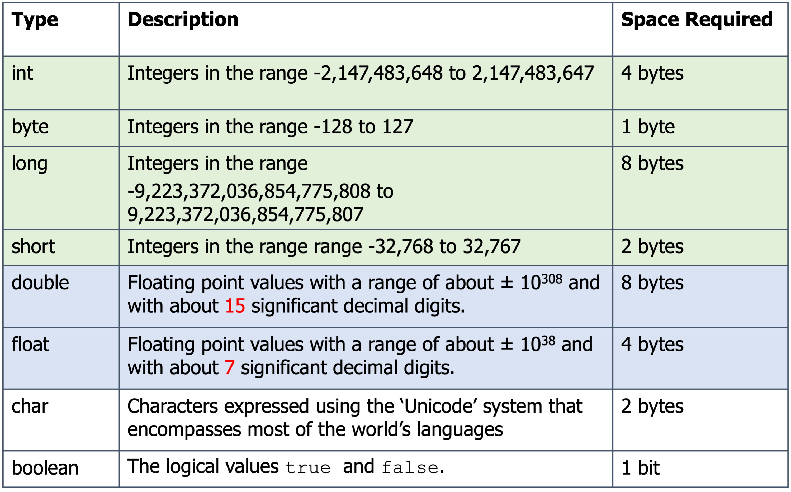
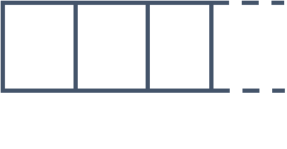
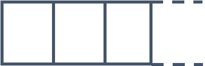
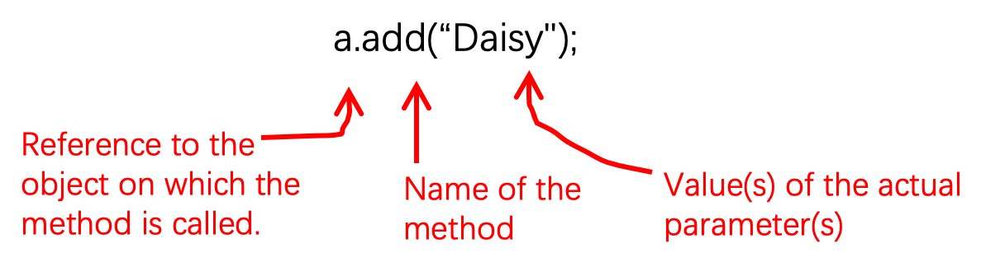

# ArrayLists and other Reference Types
  
access specifier / modifier    →    data hiding  
setters / getters   →    data hiding  
`( )`    调用方法（函数）  
`[ ]`    用于Array  
```Java
Array[] example = new HashMap[50]
//Have to begin with n element (n > 0)
```
  
## Java Types We Have Met So Far
  
- int, long, short, byte, float, double, char, boolean
- Arrays
- (Class type) String, Scanner, and other classes from the Java API(Application Program Interface)
  
| Type    | Description                                                                                              | Space Required |
| ------- | -------------------------------------------------------------------------------------------------------- | -------------- |
| int     | Integers in the range `-2,147,483,648` to `2,147,483,647`                                                | 4 bytes        |
| byte    | Integers in the range `-128` to `127`                                                                    | 1 byte         |
| long    | Integers in the range `-9,223,372,036,854,775,808` to `9,223,372,036,854,775,807`                        | 8 bytes        |
| short   | Integers in the range range `-32,768` to `32,767`                                                        | 2 bytes        |
| double  | Floating point values with a range of about $± 10^{308}$ and with about `15` significant decimal digits. | 8 bytes        |
| float   | Floating point values with a range of about $± 10^{38}$ and with about `7` significant decimal digits.   | 4 bytes        |
| char    | Characters expressed using the ‘Unicode’ system that encompasses most of the world’s languages           | 2 bytes        |
| boolean | The logical values true and false.                                                                       | 1 bit          |


  
## Heap Memory
  
- **ArrayLists** and **HashMaps** will be stored in heap memory
- Heap memory is ***dynamic***
- We can "ask" the OS/JVM for more heap space as needed
- Heap memory can be anywhere in RAM
- Location is not essential
- Location can change
- Use references to find data
- Variables only store references to values in the heap
  
## Array, ArrayList and HashMaps
  
- We have also met arrays but came across the limitation that the size of the array must be determined when it is created, and cannot thereafter be changed.
	- If we cannot put an upper limit on the number of students, then arrays are not a solution. What we need is something that works a bit like an array, but which can expand to accommodate any number of students.
- If we want a collection of values that can grow dynamically to accommodate new data then we must use some other means of storing that data. One such mechanism is the ArrayList class.
  
## Lists
  
- Lists are flexible-length data structures where the data is ordered linearly.
- Each element of the list holds some data.
- Automatically expands when a new item is added
- Automatically shrinks when items are removed

## Arrays vs Lists
  
| Arrays                                                                                       | Lists                                                                       |
| -------------------------------------------------------------------------------------------- | --------------------------------------------------------------------------- |
| Arrays are **fixed-length**: once memory is assigned, the length of the array remains fixed. | Lists can **grow or shrink** in length as a program runs.                   |
| ***static*** **data structures**: They are fixed-size.                                       | **Dynamic data structures:** They can change in size whilst a program runs. |
|                                                     |                                    |
  
## The ArrayList / HashMap Class
  
```Java
import java.util.ArrayList;    //required packages for ordered list
import java.util.HashMap;    //required packages for unordered list
import java.util.Scanner;
import java.util.Collection;
(import java.util.*;)
ArrayList<String> myList;    //declare list in Java｜<数据类型>
HashMap<String, Integer> bills;    //declare map｜<键，值>
myList = new ArrayList<>();    // initialize the list to null
bills = new HashMap<>();    // initialize the map to null
//both declaration and initialize
ArrayList<String> myList = new ArrayList<>();    
HashMap<String, Integer> bills = new HashMap<>();
//Can begin with 0 elements
```
  
### Initialising…
  
- We can declare that a variable `myStringList` refers to **`ArrayList`** whose elements are Strings and allocate space for it as follows:
```Java
ArrayList<String> myStringList; //declaration
myStringList = new ArrayList<>(); //allocation of space
```
  
- Similarly, we declare a variable bills refers to  HashMap whose keys are Strings and values are integers as follows:
```Java
HashMap<String, Integer> bills; //declaration
Bills = new HashMap<>(); //allocation of space
```
  
 - The declaration and initialization can be combined into a single line as follows:
```Java
ArrayList<String> myStringList = new ArrayList<>();
```
  
### Adding Values…
  
```Java
myList.add("Something");
myList.add(index, "Something");
bills.put(key, value);
```
  
### Retrieving Values…
  
```Java
myList.get(int index);    //index begins with 0
bills.get(key);
```
  
- `==` compares the address (reference)
- `.equals()` compares the value rather than address
  
### Reference Types and Assignment
  
If we perform an assignment on a reference type variable, we change its value. That is to say that we change the location that it points to.
```Java
ArrayList<String> a;
ArrayList<String> b;
a = new ArrayList<>();
b = a;
/*
The variables a and b now point to the same location. 
Calling a method on b has the same effect as calling that method on a.
*/
a.add("Daisy");
b.add("Sunny");
if (a==b) {
/*
Because the variables have the same value, 
they are equal in the sense tested by ==
*/
   System.out.println("ArrayLists are equal");
}
System.out.println("a.get(1) = " + a.get(1));
System.out.println("b.get(1) = " + b.get(1));
```
  
### Methods

 - The difference between reference types and primitive types is that methods can be called on a variable of reference type.
 - The add and get methods that we have just met are examples of methods that can be called on an ArrayList object.
 > [!IMPORTANT] 
 > You can’t call a method on a primitive type.
  
#### Instance Methods and Static Methods
  
- Two kinds of methods in Java: **instance methods** and **static methods**:
	- **Instance methods** need to be called on a particular object, and can do different things if called on different objects.
	- For example the `add`, and `get` methods that can be called on an `ArrayList` object are **instance methods**.
	```Java
	ArrayList<String> a = new ArrayList<>();
	ArrayList<String> b = new ArrayList<>();
	a.add("Daisy");
	b.add("Sunny");
	String s = a.get(0);
	```
  
- **Static methods**, do not need to be called on any particular object. They are and can be used in the main Class to divide the main method into sub-programs.
  
#### More ArrayList Methods
  
If a is an ArrayList variable, i is an int, and e is an object whose type matches the element type of the ArrayList then…
  
<html><body><table><tr><td>a.size()</td><td>Returns the number of elements in the list</td></tr><tr><td>a.add(i,e)</td><td>Adds element e to the list at index i. All elements at indexes greater than i get moved up to accommodate the new element (in other words their indexes increase by 1)</td></tr><tr><td>a.remove(i)</td><td>Removes the element at index i</td></tr><tr><td>a.get(i)</td><td>Returns the element e at index i, the element is not removed from the list</td></tr><tr><td>a.clear()</td><td>Removes all elements from the ArrayList</td></tr></table></body></html>  
Full documentation at https://docs.oracle.com/en/java/javase/11/docs/api/java.base/java/util/ArrayList.html  
  
#### More HashMap Methods
  
If a is variable, whose type matches the element type of the HashMap then…
  
<html><body><table><tr><td>a.size()</td><td>Returns the number of key-value mappings in this map</td></tr><tr><td>a.put​(K key, V value)</td><td>Associates the specified value with the specified key in this map</td></tr><tr><td>a.remove(key)</td><td>Removes the mapping for the specified key from this map if present</td></tr><tr><td>a.get(key)</td><td>Returns the value to which the specified key is mapped, or null if this map contains no mapping for the key</td></tr><tr><td>a.clear()</td><td>Removes all of the mappings from this map</td></tr><tr><td>a.values()</td><td>Returns a <a href="https://docs.oracle.com/en/java/javase/11/docs/api/java.base/java/util/Collection.html">Collection</a> view of the values contained in this map</td></tr><tr><td>a.keySet()</td><td>Returns a Set view of the keys contained in this map</td></tr></table></body></html>  
Full documentation at https://docs.oracle.com/en/java/javase/11/docs/api/java.base/java/util/HashMap.html  

## The `null` Value
  
- Sometimes we want to explicitly state that a reference type variable doesn’t refer to anything at all.
- Done by assigning it the value null.
- We can also test whether a reference variable has the value null.
- Attempting to **call a method** on a variable whose value is null results in an **error** *(commonest error)*
```Java
ArrayList<String> words = null;
if (words == null) {
   System.out.println("It's null");
}
```
  
## Calling an Instance Method
  
- To call an instance method, Java needs to know three things:
	- The object.
	- The method name.
	- The value(s) of its actual parameter(s) (if there are any).

  
## Calling a Static Method
  
- If you wish to call a static method that belongs to a class other than the one from which you are making the call, then you must prefix the method with the name of the class (not an object of this class). For example `double x = Math.sqrt(2);` Calls the `sqrt` (square root) method of the `Math` class
  
- If you are calling one method from another method in the same class, then you do not need to **prefix** the method call with the name of the **class**.
```Java
public static void main(String[] args) {
    int val = 3;
    printFactorial(val);
/*
If printFactorial is in the same class as main, 
then we do not need to specify this class when calling it
*/
}
public static void printFactorial(int n) {
  System.out.println(n);
}
```
  
## Method **Overloading**
  
- An object may have two or more methods of the same name that differ in the type and/or the number of actual parameters that need to be supplied.
- Examples: If a is a ArrayList then:
  
<html><body><table><tr><td>a.add(e)</td><td>Adds element <strong>e</strong> to the <strong>end</strong> of the list.</td></tr><tr><td>a.add(i,e)</td><td>Adds element <strong>e</strong> to the list at <strong>index i</strong>. Elements previously located indexes i and above are moved up to make room</td></tr></table></body><br></html>

## Declaring Reference Type Variables
  
- To declare a reference type variable we specify the type of the object that the variable will point to. We may also have to supply a type parameter for this variable, enclosed in angle brackets `< … >`
- When declaring an ArrayList we supply a type parameter to indicate the type of element the ArrayList contains, for example `ArrayList<String> a;` 
- Other reference types, such as String, or Scanner, do not require a type parameter `Scanner kb;`
  
## Constructors
  
- When we create an object, the keyword **new** is followed by a **constructor** for the object.
- A constructor has a name, which is always the same as the type of the object being created. It may take type parameters, enclosed in **angle brackets** `<…>` and actual parameters, enclosed in **round brackets** `(…)`. The type parameter can often be replaced by an **empty** set of angle brackets `<>`  
Examples:
```Java
 ArrayList<String> a  = new ArrayList<String>();
 //Constructor with explicit type parameter
 ArrayList<String> a  = new ArrayList<>();
 //Type parameter replaced by <> because it can be inferred that it is String
 Scanner kb = new Scanner(System.in);
```
  
## ArrayLists and Primitive Types
  
- The elements of an ArrayLists must be of reference type. You can't have lists of things that are of primitive type.
- So, for values like, e.g. integers, we need a wrapper class. For integers, Integer is the wrapper class for int: `ArrayList<Integer> intList = new ArrayList<>();` 
- Double is the wrapper class for double `ArrayList<Double> doubleList = new ArrayList<>();` 
- There are similar wrapper classes for the other six primitive types
```
byte - Byte, short – Short, long – Long
float – Float, char – Character, boolean - Boolean
```
  
## What is a Wrapper?
  
- A wrapper class wraps or “boxes” a primitive value inside an object. The value itself is made available by calling an appropriate method on the object.
- The value to be “wrapped” is supplied as an actual parameter of the constructor. So to create a wrapper object for the value 2 we could write `Integer twoWrap = new Integer(2);`
- To retrieve the “wrapped” value we call the `intValue` method, like this `int i = twoWrap.intValue();` 
  
## Autoboxing and Unboxing
  
If we were required to wrap and unwrap primitive values explicitly, in the manner illustrated in the previous slide, then adding them to ArrayLists would be a long-winded process.
```Java
ArrayList<Integer> intList = new ArrayList<>();
intList.add(new Integer(2));
Integer wrapper = intList.get(0);
int i = wrapper.intValue();
```
  
- Luckily Java will, most of the time, work out what we want, and do the wrapping and unwrapping for us
```Java
ArrayList<Integer> intList = new  ArrayList<>();
intList.add(2);
//Java works out that the int needs to be wrapped in an Integer and does it for us.
int i = intList.get(0);//The get method returns an Integer.
//Java works out that this needs to be converted to an int, and does it for us.
```

## The Enhanced for loop
  
- In some cases we can simplify for loops that iterate over arrays or ArrayLists. For example, given a variable
	 `ArrayList<String> listOfStrings;`
	Rather than the fiddly
```Java
for (int i=0; i<listOfStrings.size(); i++) {
    String s = listOfString.get(i);
    ... // do something with the string s
}
```
  
We can write the equivalent
```Java
for (String s : listOfStrings) {
    ... // do something with the string s
}
```
  
## Further Referring
> [!TIP] 
> 📖 [堆内存与栈内存举例讲解](./Heap&Stack_cn.md) [^1]
> [^1]: 感谢 [Bertrand](https://github.com/thedignityofcoffee) 同学提供扩展阅读材料
