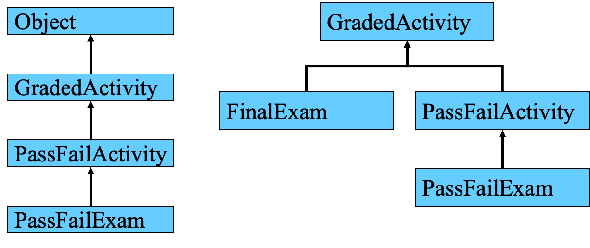
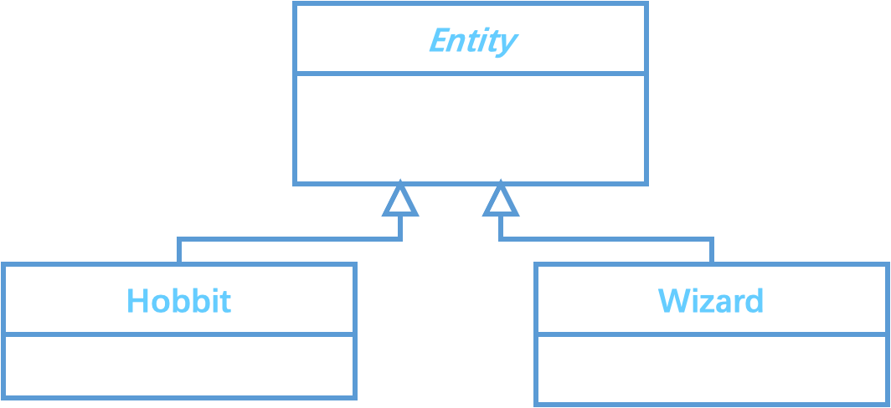

# Introduction to Inheritance and “Is a” Relationship
  
review：encapsulation、data hiding  
Association relationship：has  
  
## Inheritance
  
- A *superclass* is a more generalized class
- A *subclass*  a more specialized class
  
<html><body><table align="center"><tr><td align="center"><strong>GradedActivity</strong></td></tr><tr><td>- score : double</td></tr></table></body><p align="center">↑<br>|<br>|</p></html>
<html><body><table align="center"><tr><td align="center"><strong>FinalExam</strong></td></tr><tr><td>- numQuestions : int<br>- pointsEach : double<br>- numMissed : int</td></tr></table></body></html>  
  
```Java
public class Car extends Vehicle{

}
```
  
> [!NOTE] 
> Inheritance can only go up
  


### Subclasses and Superclasses
  
- The more general class is known as the superclass **`Entity`**
- The more specialized class is known as the subclass **`Hobbit`**
- An instance of the subclass can be used whenever an instance of the superclass is required, e.g.
```Java
Entity entity;
entity = new Hobbit("Bilbo", 30);
```
  
> [!NOTE]  
> A subclass in turn can have its own subclass, and so on.
  
### The `extends` keyword
  
- The relationship between a superclass and subclass is declared with the use of the **`extends`** keyword.
- A class may have **one**, **many** or **no** subclasses.
- A class may have only ***one*** superclass.
- No multiple inheritance!
- The **`this`** keyword
  
> [!TIP]  
> Remember: within a class, the keyword **`this`** is a **reference** to the **instance** of the class and allows us to refer to the attribute of the class rather than the **passed-in** parameter.
   
### Inheritance and constructors
  
- The subclass requires its own constructor.
- This constructor will *always* make a call to a constructor of its superclass.
- You can make this call explicit using the keyword **`super`**.
- If you do not call the superclass constructor explicitly then Java will try to call a superclass constructor *that takes* ***no arguments*** – if it can’t find one then it will report an error.

```Java
public class Entity {
	private String name; 
	private String symbol;
	private int x,y;
	private World world;
	public Entity(String name, String symbol) {//Constructor of Entity class
		this.name = name;
		this.symbol = symbol;
	}
}
```

```Java
public class Hobbit extends Entity {
	// name, sides, x and y inherited
	private int health ;  
	public Hobbit(String name, int health) {//Constructor of Hobbit class
		super(name, “#”);//Call to superclass constructor. This must always be the first thing the subclass constructor does.
		this.health = health;
}
```

```Java
public class Entity {
	private String name;
	private String symbol
	public void setName (String name){
		this.name = name;
	}
}
```

> [!NOTE]  
> If we don’t write a constructor for the class, Java will create one for us. It will take no parameters, and assign a null value to name and symbol.  
> *Note that Java only does this if we haven’t written a constructor ourselves.*

```Java
public class Hobbit extends Entity {
	private int health;
	public Hobbit (int hobbit) {
		//super();
	health = hobbit;
	}
}
```

> [!NOTE]  
> We do not write the superclass constructor. However the superclass has a constructor taking no parameters. Java will call it for us.  
> *Note that if there wasn’t a superclass constructor with no parameters then Java would report an error.*
  
### Inheritance and overriding
  
- The subclass can also have methods that *override* methods of the superclass, with the same **name & parameters**
- **Overriding** is an example of ***polymorphism***. That’s were you have two methods of the same name that *behave differently*.

use keyword `@Override`  

```Java
@Override
public void exampleFunction() {

}
```
  
## Access Control
  
A method or attribute declared **public** will be available to/modifiable by all **subclasses**.  
A method or attribute declared **private** is not modifiable or directly accessible by **subclasses**. In that case public “getter” and “setter” methods like `public int getX()` provide access.  
  
### Access Specifiers
  
| Access Modifier       | Accessible to a subclass inside the same package? | Accessible to all other classes inside the same package? | Accessible to a subclass outside the package? | Accessible to all other classes outside the package? |
| --------------------- | ------------------------------------------------- | -------------------------------------------------------- | --------------------------------------------- | ---------------------------------------------------- |
| default (no modifier) | ✓                                                 | ✓                                                        | ×                                             | ×                                                    |
| Public                | ✓                                                 | ✓                                                        | ✓                                             | ✓                                                    |
| Protected             | ✓                                                 | ✓                                                        | ✓                                             | ×                                                    |
| Private               | ×                                                 | ×                                                        | ×                                             | ×                                                    |
  
## Overriding `move`
  
```Java
public class Entity {
	private String name; 
	private String symbol;
	private int x,y;
	public Entity(String name, String symbol) {
		this.name = name;
		this.symbol = symbol;
	}
	public void move() {
	}
}
```

```Java
import java.util.Random;
class Hobbit extends Entity {
	// name, sides, x and y inherited
	private int health;
	public Hobbit(String name, int health) {
		super(name, “#”);
		this.health = health;
	}
	public void move() {
		Random random = new Random();
		int rx = random.nextInt(3);
		//number between 0 and 2
		int ry = random.nextInt(3);
		switch(rx){
			case 1:
				setX(getX() + 1);
				break;
			case 2:
				setX(getX() - 1);
				break;
			}
		switch(ry){
			case 1:
				setY(getY() + 1);
				break;
			case 2:
				setY(getY() - 1);
				break;
			}
		health--;
	}
}
/*Work on exercises 4*/
```
  
## Overriding `toString`
  
```Java
public class Entity {
	private String name; 
	private String symbol;
	private int x, y;
	public Entity(String name, String symbol) {
		this.name = name;
		this.symbol = symbol;
	}
	public String toString() {
		return name + " " + symbol + "x" + x + "y" + y;
	}
}
```

```Java
public class Hobbit extends Entity {
	...
	@Override
	public String toString() {
		String string = super.toString() + "\n";
		string += "health" + health;
		return string;
	}
}
/*Work on exercises 5*/
```
  
## Polymorphism
  
The method called depends on which class an object is an instance of, e.g.
```Java
Entity entity = new Hobbit("Bilbo", 200);
```
will result in the method from the Hobbit class being called when
```Java
entity.move()
```
is called, because `entity` is an `Entity` object.  
  
*Polymorphism* is an ability to change what a method does depending on the type of an object.  Both *overloading* and *overriding* are examples of polymorphism.
  
## Overriding Superclass Methods
  
- Recall that a method’s ***signature*** consists of:
	- the method’s name
	- the data types of the method’s parameters in the order that they appear.
- A subclass method that **overrides** a superclass method must have the same signature as the superclass method.
- An object of the subclass invokes the **subclass’s** version of the method, not the **superclass’s**.
  
## Overriding and overloading Methods
  
- There is a distinction between ***overloading*** a method and ***overriding*** a method.
- ***Overloading*** is when a method has the same name as one or more other methods, but with a **different signature**.
```Java
int sum(int a, int b)
double sum(double a, double b)
```
- When a method ***overrides*** another method, however, they both have the **same signature**. Which one is used is determined by the **object** that invokes that method.
- `Work on exercise 6`
  
## Object
  
Object is the supersupersuper... class of every single class. Everything extends Object (though you don’t have to write that explicitly!)  
The Object class provides various useful methods to every class, which include  
`boolean equals(Object obj)`
Indicates whether some other object is “equal to” this one.  
  
`String toString()`  
return a string with information about this object.  
  
Since every class extends Object we can override these methods.  
  
See also the [Java API documentation](http://java.sun.com/javase/6/docs/api/)
  
## Chains of Inheritance
  
- A superclass can also be derived from another class.
  

  
## Abstract classes
  
- Sometimes we do not want to create direct instances of a superclass. For example we might want to insist that all instances of the Entity class are instances of some particular subclass of Entity – for example a Wizard or Hobbit.  
  We can achieve this by making the class abstract. We do this by putting the word abstract in its declaration.  
  
- A class that is not abstract is said to be concrete.
*(Assume class Hobbit is a subclass of class Entity)*
  
```Java
public abstract class Entity {
	private String name;
	…
```

```Java
/*The compiler will not allow this because we cannot have a direct instance of an abstract class.*/
Entity entity = new Entity(“I do not know the name“, 0);
Entity entity = new Hobbit(“Fodor”, 100);
/*This is OK because we are creating an instance of a concrete subclass*/
```
  
## Abstract methods
  
- An abstract class may have abstract methods.
- An abstract method is declared, but not implemented.
  
```Java
public abstract class Entity {
	private String name; 
	private String symbol;
	private int x, y;
	private World world;
	public Entity(String name, String symbol) {
	//This is a concrete method. It has an implementation.
		this.name = name;
		this.symbol = symbol;
	}
	public String getSymbol() 
		return symbol;
	}  
	public abstract void move();
/*This is an abstract method. It has no implementation. It must be overridden, and implemented, in concrete subclasses*/
}
```
  
## Abstract classes in UML version 1
  
- You can indicate that a class or method is abstract by writing its name in *italics*.


  
## Uses of inheritance
  
- If classes are arranged into inheritance then we can write **methods** that will work for **any subclass** of a given superclass.
  
```Java
//The formal parameter is of type Entity. This is OK because the display method is defined in the Entity class.
public static void display (Entity entity) {
	System.out.print(entity.toString());
}
```

```Java
Wizard wizard = new Wizard("Gandalf", 200, 200);
Hobbit hobbit = new Hobbit("Bilbo", 200);

display(wizard);
//When we call the method the actual parameter can be anything that is a concrete subclass of Entity
display(hobbit);
```

## Casting
  
You can cast objects of one type into another,  
so long as the types are compatible. e.g.  
if Wizard and Hobbit are subclasses of Entity  
```Java
Entity[] myTeam = new Entity[4];
myTeam[0] = new Hobbit(”Bilbo”, 200);
myTeam[1] = new Wizard(“Gandalf”, 200, 200);
Hobbit hobbit1 = (Hobbit) myTeam[0];
Hobbit hobbit2 = (Hobbit) myTeam[1];//This will cause an error at run time, because myTeam[1] is not a Hobbit instance.
```
  
## Uses of inheritance
  
- If classes are arranged into inheritance then we create lists whose elements must be subclasses of a given superclass, but which can be of **any subclass**.
  
```Java
ArrayList<Entity> entities = new ArrayList<>();
entities.add(new Wizard(“Gandalf”, 200, 200);
entities.add(new Hobbit(”Bilbo”, 200));
for (Entity entity : entities) {
	System.out.println(entity.toString());
}
```
> [!TIP]
> We can add objects of any subclass of Entity to the list. But we can’t add any object that is not an instance of some Entity subclass.
  
## Why use Inheritance?
  
- Avoid writing **shared code** more than once
	- Useful for the lazy programmer’s **toolbox**
	- **Reduces** the opportunities for **error**.
- Useful for helping to **structure programs**
	- There are other features of object-oriented programming languages that help with this too
- Make **explicit** the **relationships** between different types of objects
- Can **extend** library classes with **extra** features
  
