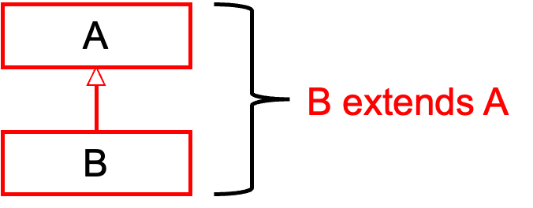
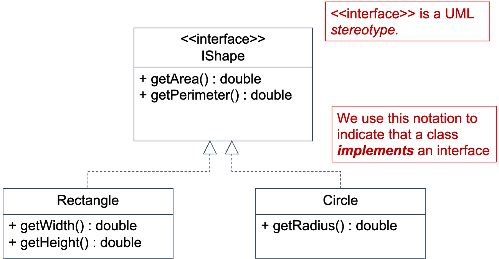
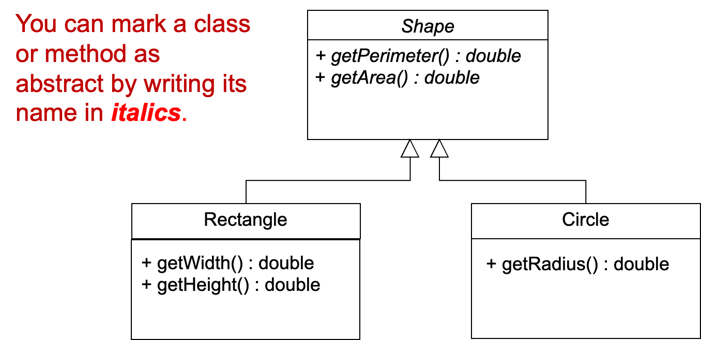
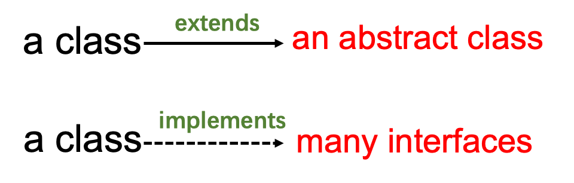

# Interfaces and Abstract Classes
  
使用 static 关键字修饰的方法属于类，不需要实例化对象即可调用。在主方法或其他静态环境中调用时，必须使用类名作为前缀。
✅ Encapsulation  
✅ Data Hiding  
✅ Inheritance  
✅ Polymorphism / abstraction  

- Inheritance (superclass and subclass)
    - Java keywords: extends, super and this

- Polymorphism
    - Overloading and overriding
  
## signature
  
方法的参数类型、数量
  
## Polymorphism
### overloading（重载）
  
- same name
- same or different (both ok) return data type
- different signature
- different operation
  
### overriding（覆写）

- same name
- same return data type
- same signature
- different operation

| 区别点  | 重载方法 | 重写方法                    |
| ---- | ---- | ----------------------- |
| 参数列表 | 必须修改 | 一定不能修改                  |
| 返回类型 | 可以修改 | 一定不能修改                  |
| 异常   | 可以修改 | 可以减少或删除，一定不能抛出新的或者更广的异常 |
| 访问   | 可以修改 | 一定不能做更严格的限制（可以降低限制）     |
  
| 序号   | 区分点 | 重载（Ooverload）          | 重写（Override）           |
| ---- | --- | ---------------------- | ---------------------- |
| No.1 | 概念  | 方法的名字相同，方法中的参数个数或者类型不同 | 方法的名字，参数类型，参数个数与父类完全相同 |
| No.2 | 范围  | 重载的时候，两个方法要在同一个类中      | 重写要求被重写的类和要重写的类是继承关系   |
| No.3 | 限制  | 对访问限定符没有要求             | 重写的类的访问限定符不能比父类的权限大    |
  
```Java
public class Animal {
    public void animalSound() {
        System.out.println("The animal makes a sound");
    }
}

public class Dog extends Animal {
    @override
    public void animalSound() {
        System.out.println("The dog says: bow wow");
    }
}

public class Cat extends Animal {
    @override
    public void animalSound() {
        System.out.println("The cat says: meow");
    }
    //Overload
    public void animalSound(int times) {
        for(int i = 0; i < times; i++) {
            System.out.println("The cat says: meow");
        }
    }
}
```


## Abstract
### Abstract Classes
  
- 抽象类不能被实例化，但可以从它派生出其他类。
- 抽象类充当其他类的超类（superclass）。
- 抽象类表示从它派生的所有类的泛型或抽象形式。
- A class becomes abstract when you place key word "abstract" in the class definition.
```Java
public abstract class ClassName {

}
```
- 抽象类中可以有具体类，也可以有抽象类。
```Java
public abstract class Shape {
    private int x, y;
    public abstract double getArea();
    public abstract double getPerimeter();
}

public class Rectangle extends Shape {
    private double width, height;
    ...
    public double getArea() {return width * height;}
    public double getPerimeter() {return 2 * width + 2 * height;}
    ...
}
```
  
### Abstract Methods
  
- 抽象方法没有主体，必须在子类中重写。
- 抽象方法是出现在超类中，但期望在子类中被重写的方法。
- 抽象方法只有头部，没有主体。
  
## Interface
  
- Interface是一个完全的“抽象类”，用于将具有空主体的相关方法分组。
- 仅在超类中声明，并期望在子类中被重写。
- 仅包含抽象类
```Java
AccessSpecifier interface InterfaceName {

}
```

```Java
public interface IShape {
    public double getArea();
    public double getPerimeter();
}
```

```Java
public class Rectangle implements IShape {
    private double width, height;
    public Rectangle(double width, double height) {
        this.width = width;
        this.height = height;
    }
    @Override
    public double getArea() {
        return width * height;
    }
    @Override
    public double getPerimeter() {
        return 2*width + 2*height;
    }
}
```
Interface类似于具有所有抽象方法的抽象类。
***它不能被实例化***，并且接口中列出的所有方法都必须在其他地方编写。
Interface的目的是为其他类指定行为。
- Interface看起来类似于类，除了：
    - 使用关键字interface代替关键字class，并且在接口中指定的方法没有主体，只有以分号结束的头。
    - Interface has no attributes（只能有常量）、constructors
    - Interface不是类，因此不能使用extends和super()，而应该使用implements
  
Interface实际上是抽象类的极端情况，其中所有的方法都是抽象的。
  
Interface还可用于方法形式参数的类型，而且是super type
extends可以选用部分属性和方法
implement必须使用全部方法（无属性）
  

  
We can assign a sub type to a super type，反之不能
A a;
B b;
a = b;
❌ ~~b = a;~~
  
- 在Java中，每个变量、参数和表达式都有一个类型。
- 类型可以有子类型。
- 类是一种类型，它的子类是该类型的子类型。
- 赋值操作右侧表达式的类型必须与左侧类型相同，或者是左侧类型的子类型。
  
```Java
public class Animal {
    private String name;
    public Animal(String name) {
        this.name = name;
    }
    public void animalSound() {
        System.out.println("The animal makes a sound");
    }
}
//extends, super, this
public class Cat extends Animal {  
    public Cat (String name) {
        super(name);
    }
}
```
### Interfaces as types
  
An interface is also a type.
  If Class B implements interface A
    → B is a subtype of A.
  
We can use IShape as the type of the formal parameter of the printShape method.  The actual parameter supplied to the method must be something that implements the IShape interface.
```Java
public class Main {
    public static void printShape( IShape ishape) {       
        System.out.println("Area = " + ishape.getArea());
        System.out.println("Perimeter = " + ishape.getPerimeter());       
    }
    public static void main (String[] args) {       
        //Rectangle rectangle = new Rectangle(20, 30);
        Circle circle = new Circle(20);
        printShape(circle);
        
        IShape ishape1 = new Rectangle(10, 20);
        IShape ishape2 = new Circle(20);
        printShape(ishape1);
        printShape(ishape2);
        ArrayList<IShape> shapes = new ArrayList<>();
    }
}
```
  
## UML
### Interfaces in UML
  

  
### Abstract classes in UML
  

  
### Differences between abstract classes and interfaces
  
- If a class extends an abstract class then it can’t extend any other classes (apart from the superclasses of the abstract class).
- A class can implement as many interfaces as you like.

```Java
public abstract class Shape implements IShape, Transformable {
    …
}
```
  

  
### Interfaces in UML
  

  
