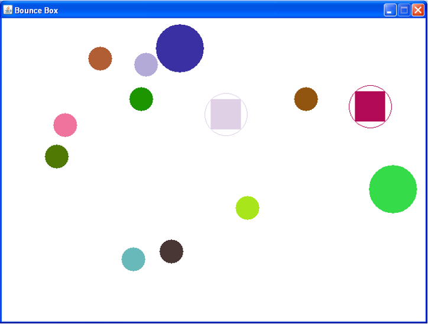
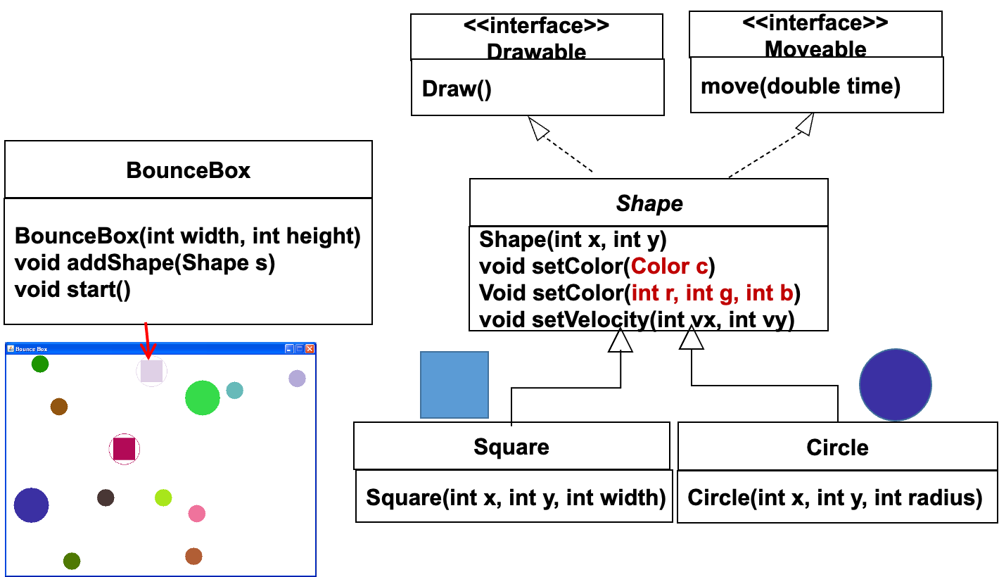

# Textfiles
## Revision
  
5 concepts:  
1. Encapsulation封装
2. Inheritance继承
3. Polymorphism多态
4. Abstraction（abstract class、interface）
5. Data/Information hiding
  
code reuse
  
## OOSE
  
Object Oriented Software Engineering  
OOA    OOD    OOP  
Object Oriented Analyzing  
Object Oriented Design  
Object Oriented Programming  
  
## New version: a Shape Interface
  
```java
public abstract class IShape {
    public abstract double getArea();
    public abstract double getPerimeter();
    //Methods signatures, but no body
}
```
↓  
```java
public interface IShape {
    public double getArea();
    public double getPerimeter();
    //Method signatures, but no body (i.e. no implementation)
}
```
  
## Input and Output Streams
  
- An *input stream* is just a sequence of characters or numbers that are **read**, one after the other, by a computer program.
- An *output stream* is a sequence of characters or numbers that a computer program **writes**.
- Most of the programs you have written so far have been “**console applications**” that read data from the *standard input stream* and writes data to the *standard output stream*.
- We will discuss these streams briefly and then show how we can create other streams whose sources and destination are **files**.
  
```java
import java.io.*; //For File class and FileNotFoundException
import java.util.Scanner; //For the Scanner class
Scanner scanner = new Scanner(System.in);
//System.in is an object that represents the standard input stream
System.out.println("Enter two numbers to be added");
int i = scanner.nextInt();
int j = scanner.nextInt();
System.out.println("That makes " + (i + j));
//System.out represents the standard output stream
```
  
### Reading and Writing Text Files
  
- When we create programs that **read and write files**, we also use **streams**. However instead of using the standard input and standard output streams, we create streams that are read from, and written to, **files**.
- We shall begin by looking at a very simple program that simply copies a file.
  
#### Case Study 1: Copying a File
  
- Here is a simple program that reads a file named `infile.txt` and copies it to a file called `outfile.txt`. In subsequent slides we will go through this program line by line to make sure we understand it.
  
```java
public static void main(String[] args) throws FileNotFoundException {
    FileInputStream fileIn = new FileInputStream("infile.txt");
    Scanner scan = new Scanner(fileIn);
    PrintWriter fileOut = new PrintWriter("outfile.txt");
    while (scan.hasNextLine()) {
        String line = scan.nextLine();
        fileOut.println(line);
    }
    fileOut.close();
}
```
  
##### Creating and Reading a File Input Stream
  
- Up to now we have read data by passing the ‘built-in’ input stream System.in to the constructor of a Scanner.
- We can create our own input streams, linked to files, and use them in a similar way.
  
```java
//Built in standard input stream
Scanner scan = new Scanner(System.in);
FileInputStream fileIn = new FileInputStream("infile.txt");
//File input stream
Scanner scan = new Scanner(fileIn);
```
  
##### Creating and Writing to a File Output Stream
  
- In previous programs we have generated output by writing to the ‘built-in’ output stream `System.out`.
- We can create our own output stream, associated with a file, and use it in exactly the same way as System.out.

```java
System.out.println(“Hello world”); //Built in standard output stream
PrintWriter fileOut = new PrintWriter("outfile.txt"); //File output stream
while (scan.hasNextLine()) {
    String line = scan.nextLine();
    fileOut.println(line);
}
```
  
##### Closing a File
  
- When we write text to a file (using `println`) the system does not necessarily transfer the text immediately to a physical output device such as a disk (this would be unnecessary and  inefficient).
- When we explicitly close a file, we effectively tell the system that all data that has been written should be transferred to disk (if it hasn’t already been so), and that any resources associated with the file are released (you don’t need to know exactly what that means).
  
```java
System.out.println(“Hello world”);
PrintWriter fileOut = new PrintWriter("outfile.txt");
while (scan.hasNextLine()) {
    String line = scan.nextLine();
    fileOut.println(line);
    //This does not necessarily transfer data to disc.
}
fileOut.close()
//Make sure that all output is ‘flushed’ to disc.
```
  
##### More on The Scanner Class
  
- We have so far used the Scanner class just to read data. We can also use it to work out what can be read. For example we can use the hasNextLine method to tell us whether there are any more lines of data to be read (if there aren’t then we have reached the end of the file).

```java
//Have we read the last line in the file?
//If not then read another line
while (scan.hasNextLine()) {
    String line = scan.nextLine();
    fileOut.println(line);
}
```
  
##### Exceptions
  
- There are factors, beyond the control of the programmer, that might cause a program to fail. When this happens, a *checked exception* occurs.
- A checked exception is an exceptional condition that Java will check that you have recognized.
    - Your choices, as a programmer, are to **catch** the exception (this means that you do something about it) or to **throw** the exception (this means that you tell the compiler that you have recognized that the exception can occur, but you aren’t going to handle it at the point where it occurs).
- We won’t be **catching** exceptions for now but we will throw them. You do this by adding a **throws** clause to the method in which the exception can occur.
  
```java
//We don’t want to handle (catch) the exception so the main method must throw it.
public static void main(String[] args) throws FileNotFoundException {
    FileInputStream fileIn = new FileInputStream("infile.txt");
    //Operation above can generate a FileNotFoundException
    Scanner scan = new Scanner(fileIn);
    PrintWriter fileOut = new PrintWriter("outfile.txt");
}
```
  
#### Case Study 2: Filtering a file
  
- The next application we will look at takes a file and picks out only those lines that contain a particular word.
- The word to search for is read from standard input.
  
`infile.txt`  
```
When can their glory fade?
O the wild charge they made!
All the world wondered.
Honour the charge they made!
Honour the Light Brigade,
Noble six hundred!
```
↓  
`outfile.txt`  
```
O the wild charge they made!
Honour the charge they made!
```
  
```java
public static void main(String[] args) throws FileNotFoundException {
    Scanner cScan = new Scanner(System.in);
    System.out.print("Input file ? ");
    String inFile = cScan.nextLine();
    FileInputStream fileInput = new FileInputStream(inFile);
    Scanner fScan = new Scanner(fileInput);
    System.out.print("Output file ? ");
    String outFile = cScan.nextLine();
    PrintWriter fileOutput = new PrintWriter(outFile);
    System.out.print("String to search for ? ");
    String findStr = cScan.nextLine();
    while (fScan.hasNextLine()) {
        String line = fScan.nextLine();
        if (line.contains(findStr)) {
            fileOutput.println(line);
        }
    }
    fileOutput.close();
}
```
  
##### Scanners and Tokens
  
- The Scanner class can be used to divide an input stream into tokens separated by white space.
- White space means space characters, tabs, and new lines.
- A token is any sequence of characters that does not contain any white space.
- As an example, suppose that a stream contained the text.
  
| Rode                 |                          | the                |                       |                             600                             |
| :------------------: | :----------------------: | :----------------: | :-------------------: | :---------------------------------------------------------: |
| ↑<br>This is a token | ↑<br>This is white space | ↑<br>Another token | ↑<br>More white space | ↑<br>Another token (and this one can be read as an integer) |
  
##### Scanner Methods
  
- If scan is a Scanner object then…
- `scan.next()` returns the next token in the **input** stream (as a **String**).
- `scan.hasNext()` is a boolean valued method that returns true if another token can be **read** from the **input stream**.
- `scan.hasNextInt()` is also boolean and returns true if another token can be **read** from the **input stream** and this token can be interpreted as an **integer**.
- `scan.nextInt()` returns the next token as an **integer**.
  
##### Example
  
`Input Stream`  
```
Rode the 
600
```
`Code`  
```java
String s1,s2;
int i;
if (scan.hasNext()) {
    s1 = scan.next();
}
if (scan.hasNext()) {
    s2 = scan.next();
}
if (scan.hasNextInt()) {
    i = scan.nextInt();
}
```
  
#### Case Study 3: Bouncing Shapes
  
- Our next example will be a program designed to simulate shapes bouncing around in a frictionless box.
  

  
##### Bounce Box Classes
  

  
##### The Color Class in Java GUI
  
- The Color class is built in to the Java AWT environment and, as its name suggests, it is used to represent colors.
- We construct a Color object by specifying a color constant.
	- `Color c = Color.BLUE`
	- `rgb(0, 0, 255)`

- We can also create it by giving the intensity of the red, green, and blue components.
- So
	- `Color c = new Color(255, 0, 0)`
	- `rgb(255, 0, 0)`
- makes c refer to  newly created object representing the color red.
	- `Color c = new Color(0, 0, 255)`
	- `rgb(0, 0, 255)`
- makes c refer to a newly created object representing the color blue.
  
In this exercise we will call the setColor method using 3 integer numbers from 0 to 255 for each primary color
  
##### Using the Bounce Box Classes
  
```java
BounceBox box = new BounceBox(400, 400);

Circle c1 = new Circle(20, 50, 20);
c1.setColor(Color.BLUE);
c1.setVelocity(100, 0);

Square s1 = new Square(330, 60, 40);
s1.setColor(new Color(255, 0, 0));
s1.setVelocity(-30, 0);
box.addShape(c1);
box.addShape(s1);      
box.start();
```
  
##### Configuring the Bounce Box from a Text File
  
- Rather than ‘hard coding’ the positions, velocities, and colors in our program, it would be useful to specify them in a text file.
- The text files will have the following form:
  
###### Format of Text Files
  
- To add a circle to the bounce box use a line of the form

|   Circle   |        x        |        y        |          radius           |       vx        |       vy        |          R           |           G            |           B           |
| :--------: | :-------------: | :-------------: | :-----------------------: | :-------------: | :-------------: | :------------------: | :--------------------: | :-------------------: |
| ↓<br>shape | ↓<br>x position | ↓<br>y position | ↓<br>radius of the circle | ↓<br>x velocity | ↓<br>y velocity | ↓<br>RGB color (Red) | ↓<br>RGB color (Green) | ↓<br>RGB color (Blue) |

- Where `x` `y` `radius` `vx` `vy` `red` `green` `blue` are integers representing, respectively the x and y position of the circle, its radius, the x and components of its velocity and the red, green, and blue components of its color.
- The **integers** `red` `green` and `blue` can be omitted, in which case the circle will be given a random color.
- The **integers** `vx` and `vy` can also be omitted, in which case the circle will be stationary.
---
- To add a square to the bounce box use a line of the form

|   Square   |        x        |        y        |          width           |       vx        |       vy        |          R           |           G            |           B           |
| :--------: | :-------------: | :-------------: | :----------------------: | :-------------: | :-------------: | :------------------: | :--------------------: | :-------------------: |
| ↓<br>shape | ↓<br>x position | ↓<br>y position | ↓<br>width of the square | ↓<br>x velocity | ↓<br>y velocity | ↓<br>RGB color (Red) | ↓<br>RGB color (Green) | ↓<br>RGB color (Blue) |

- Where `x` `y` `width` `vx` `vy` `red` `green` `blue` are integers representing, respectively the x and y position of the square, its width, the x and y components of its velocity and the red, green, and blue components of its color.
- The **integers** `red` `green` and `blue` can be omitted, in which case the square will be given a random color.
- The **integers** `vx` and `vy` can also be omitted, in which case the circle will be stationary.
  
###### Format of Text Files: Examples
  
`Circle 20 50 20 100 0 255 0 0`  
- Creates a circle at position (20,50) with radius 20 moving from left to right at 100 pixels per second, and colored red.
  
`Square 100 50 20 0 30`  
- Creates a square at position (100,50) of width 20, moving vertically downwards at 30 pixels per second, with a randomly chosen color.
  
`Circle 200 100 50`
- Creates  stationary circle of radius 50 at position (200,100) with a randomly chosen color.
  
##### Over to you…
  
- For your exercises you will modify the Main method of the BounceBox program so that it reads files in the format just indicated.
- You will need to make use of methods `Scanner.next()` and `Scanner.nextInt()` but it is probably best not to use `Scanner.nextLine()`.
  
