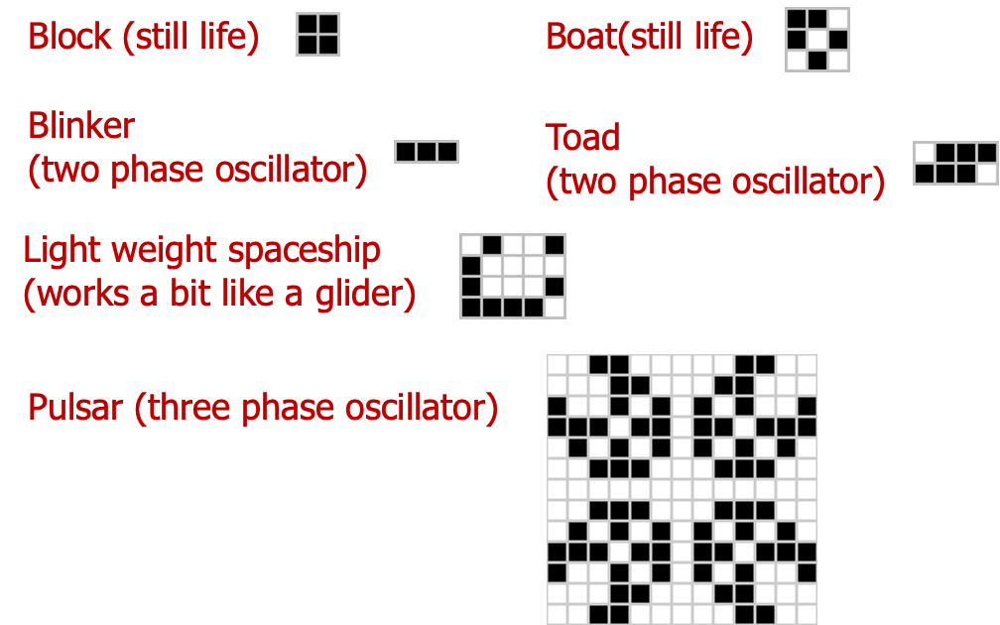

# Case Study: The Game of Life
## The “Game” of Life
  
- The “Game” of Life was invented by Mathematician John Horton Conway in 1970.
- Unlike other games, there are no players and no winning or losing.
- The game is played on an infinite square grid containing cells. Each cell is either “alive” or “dead”.
  


- You “play” the game by setting out the initial distribution of live cells and then watching the cells evolve through “generations” as follows:
- On each generation you look at the **eight** neighbors of each cell (adjacent horizontally, vertically, or diagonally). The cells evolve according to the following rules:
	- A live cell with less than **two** live neighbors dies (presumably of loneliness).
	- A live cell with more than **three** live neighbors also dies (presumably of overcrowding).
	- A live cell with **two or three** live neighbors survives.
	- A dead cell with exactly **three** live neighbors is brought back to life.
  

  
- The appeal of the game is that its very simple rules allow very interesting and sometimes very complex patterns to develop.
- Let’s look at a simple one, the “glider” or “spaceship”.
  
### The Glider
  

  
### The Gosper “Glider Gun”
  

  
### More Patterns (Courtesy of Wikipedia)
  

  
## Developing Software for the Game
  
- Unlike your practical exercises, “real” software is developed by teams of programmers. Let’s imagine that we have a team on hand to develop a Java version of life.  
 Jenny: Lead Developer  
 Bill: Senior Analyst/Programmer  
 Alex: Junior Programmer  
> [!TIP]
> *Important career advice: Real coders are never as cool or attractive as this.*

### First Team Meeting
  
- At their initial meeting the team make some important decisions.
- The first is that they are going to cheat.
- Rather than play the game on an infinite grid, they decide to play it on a grid of finite size (70\*70 cells say). Any cells outside this area are deemed to be dead.

  
### Class Responsibility Collaboration
  
- The next thing the team do is to draw up some Class Responsibility Collaboration (CRC) Cards.
- These are a “first cut” design showing what **classes** will participate in the application, their **responsibilities**, and how they **collaborate** with other classes.
  
|                      | Main                                               | Display                                                                            | Game                                                                             | Board                                                   |
| :------------------- | :------------------------------------------------- | :--------------------------------------------------------------------------------- | :------------------------------------------------------------------------------- | :------------------------------------------------------ |
| **Responsibilities** | Runs the application.                              | Displays the state of the game.<br>Tells the game when to create a new generation. | Knows the rules of the game and creates new generations when requested to do so. | Stores the state of a game (i.e. which cells are live). |
| **Collaborations**   | Creates instances of the Game and Display classes. | Collaborates with an instance of the Game class.                                   | Uses instances of the Board class to store the state of the game.                |                                                         |
  
### Development Strategy
  

  
### Jenny’s Design for the Display Class
  
<html><body><table><tr><td align="center"><strong>Display</strong></td></tr><tr><td>+ Display(game : Game, cellSize, generationTime : int)<br>+ start() : void</td></tr></table></body></html>
  
The constructor takes three arguments: 
1. `game` is a reference to the Game object to be displayed.
2. `cellSize` is the size (in pixels) of the cells in the display.
3. `generationTime` is the time (in milliseconds) that elapses between generations.
The `start()` method is called in order to start the evolution of the game.
  
### Jenny’s Requirements for The Game Class.
  
Jenny needs the Game class to implement the following methods.
  
<html><body><table><tr><td align="center"><strong>Game</strong></td></tr><tr><td>+ Game(width, height : int)<br>+ getLiveCells() : Point []<br>+ newGeneration() : void<br>+ makeCellLive(x, y : int) : void</td></tr></table></body></html>


  
### javafx.geometry.Point2D

- Point object represents a point in two dimensional space.

<html><body><table><tr><td align="center"><strong>Point</strong></td></tr><tr><td>- x, y : double</td></tr><tr><td>+ Point(x, y : double)<br>+ getX() : double<br>+ getY() : double<br>…</td></tr></table></body></html>

- Attributes representing the x and y coordinates of the point
- Accessor `getter` methods for the private x and y attributes
- There are other methods, but we don’t need to know about them!
  
### Bill’s Requirements for The Board Class.
  
Bill needs the Board class to implement the following methods.
  
<html><body><table><tr><td align="center"><strong>Board</strong></td></tr><tr><td>+ Board(width, height : int)<br>+ clear() : void<br>+ getCell(x, y : int) : boolean<br>+ makeCellLive(x, y : int) : void<br>+ getLiveCells() : Point[]</td></tr></table></body></html>

- Sets all cells in the board to be dead
- Returns true if the cell at (x,y) is alive and false if it isn’t
- These methods behave in a similar manner to the methods with the same name in the Game class.
  
### Two Coordinate Systems
  
- It is important to realize that the coordinate system that Jenny uses when she displays the game state is different to that used by Bill and Alex when they represent the state.
- Bill and Alex are representing the system using a grid in which each square represents a cell.
- The Display class displays each cell in a square whose size is determined by the <ins><strong>cellSize</strong></ins> parameter of its constructor. The cellSize represents the size of a cell in pixels.  
 <html><body><table><tr><td>Coordinate system used in Game and Board classes.</td></tr></table></body><br></html>
 <html><body><table><tr><td>Same shape displayed, with each cell occupying a square 2 pixels wide and 2 pixels in height.</td></tr></table></body><br></html>
<html><body><table><tr><td>Complete Exercise 1</td></tr></table></body><br></html>

### The Board Class <br>Version 1
  
Alex’s first version of the Board Class uses a 2D boolean array to store the cells.
  
 <html><body><table><tr><td align="center"><strong>Board</strong></td></tr><tr><td>- cells : boolean[][]<br>- width, height : int</td></tr><tr><td>+ Board(width, height : int)<br>…</td></tr></table></body></html>
  
#### Implementing the class `Board`
  
```java
public class Board {
    private int width, height;
    private boolean[][] cells;
    
    public Board(int width, int height) {
        this.width = width;
        this.height = height;
        cells = new boolean[width][height];
    }
    
    public void clear() {
        cells = new boolean[width][height];
    }
    
    public boolean getCell(int x, int y) {
        return cells[x][y];
    }
    
    public void makeCellLive(int x, int y) {
        cells[x][y] = true;
    }
    
    public ArrayList<Point>  getLiveCells(){      
       ArrayList<Point>  liveCells = new ArrayList<>();
        int i = 0;
        for (int x = 0; x < width ; x++) {
            for (int y = 0; y < height; y++) {
                if (cells[x][y]) {
                    liveCells.add(new Point(x, y));                    
                }
            }
        }
        return liveCells;
    }
} // End of Board class
```

### Implementation of the CLASS `Game`
  
- The population of each generation is calculated by looking at the population of the previous generation.
- The `Game` class therefore contains references to two `Board` objects. One is the current board and the other the previous board.
- When a new generation is created these are swapped round so that the current board becomes the previous board.

<html><body><table><tr><td align="center"><strong>Game</strong></td></tr><tr><td>- currentBoard, oldBoard : Board</td></tr><tr><td>+ Game(width, height : int)<br>+ newGeneration() : void<br>…</td></tr></table></body></html>

```java
public class Game {
    private int width, height;
    private Board currentBoard, oldBoard;
    
    public Game(int width, int height) {
        this.width = width;
        this.height = height;
        currentBoard = new Board(width, height);
        oldBoard = new Board(width, height);
    }
    public void makeCellLive(int x, int y) {
         currentBoard.makeCellLive(x, y);
    }
    public ArrayList<Point> getLiveCells() {
        return currentBoard.getLiveCells();
    }
    public int getWidth() {
        return width;
    }
    public int getHeight() {
        return height;
    }
    public void newGeneration() {
        Board temp = oldBoard;
        oldBoard = currentBoard;
        currentBoard = temp;
        currentBoard.clear();
    
        for (int x = 0; x < width; x++) {
            for (int y = 0;y < height; y++) {
                int nl = getNbrLivingNeighbours(x, y);
                if (oldBoard.getCell(x, y)
                     && (nl == 2 || nl == 3)) {
                    currentBoard.makeCellLive(x, y);
                }
                if (!oldBoard.getCell(x, y) && nl == 3) {
                    currentBoard.makeCellLive(x, y);
                }
            }
        }
    }
    private int getNbrLivingNeighbours(int x, int y) {
        int total = 0;
        for (int dx = -1; dx <= 1; dx++) {
            for (int dy = -1; dy <= 1; dy++) {
                if (dx != 0 || dy != 0) {
                    if (inBounds(x + dx, y + dy)
                        && oldBoard.getCell(x + dx, y + dy)) {
                            total++;
                    }
                }
            }
        }
        return total;
    }
    private boolean inBounds(int x, int y) {
        return x >= 0 && y >= 0 && x < width && y < height;
    }
} // End of Game class
```
<html><body><table><tr><td>Now do Exercise 3</td></tr></table></body></html>

### Implementation of the Class Main
  
```java
public class Main {
    /**
     * @param args the command line arguments
     * @throws java.io.FileNotFoundException
     */
    public static void main(String[] args) throws FileNotFoundException {
        Game game = new Game(70,70);
        readFromFile(game, "cells.txt");
        Display display = new Display(game, 10,100);
        display.start();
    }
    private static void readFromFile(Game game, String file)
      throws FileNotFoundException {
        Scanner scan = new Scanner(new File(file));
        while(scan.hasNextInt()) {
            int x = scan.nextInt();
            int y = scan.nextInt();
            game.makeCellLive(x, y);
        }
    }
} // End of Main class
```
  
### Implementation of the CLASS `Display`
  

  
<html><body><table><tr><td>Now do Exercise 4</td></tr></table></body></html>

### The Board Class <br>Version 2
  
- After all the classes have been implemented Alex suddenly has a brainwave.
  

  
- The rest of team are not happy.
  
![[Pasted_image_20250525164015.png]]
  
```java
public class Board {
    private int width, height;
    private ArrayList<Point> liveCells;
    
    public Board(int width, int height) {
        this.width = width;
        this.height = height;
        liveCells = new ArrayList<>();
    }
    
    // It is up to you to finish the new
    // implementation of the Board class...
}
```
<html><body><table><tr><td>Now do Exercise 5</td></tr></table></body></html>

## A Reality Check!
  
- In this example we have made it look as if our little team adopted a “Waterfall” approach. That is to say that they completely designed the application, before writing any code. Then they wrote the code implied by their design. And it all worked first time!
- In the real world, development does not often happen as neatly as that (unless the project is very simple, or the developers are very clever).
- It is often better to adopt a more iterative approach that works something like this. Given requirements for a complicated program:
	1. Design a simpler program that meets some of the requirements you have been given.
	2. Implement that program and check that it works.
	3. Modify the program so that it meets more of the requirements. Check that the modified program works.
	4. Repeat step 3 until you have met all of the requirements.
  
